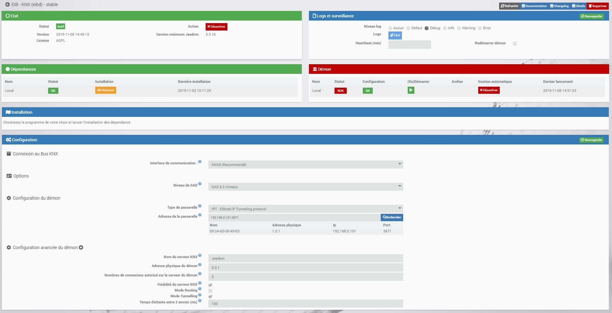

=== Installation des dépendance
Pour faciliter la mise en place des dépendances, jeedom vas gérer seul l'installation de la suite logiciele EIBD.

Dans la cadre réservé aux dépendances, vous allez avoir le statut de l'installation.
Nous avons aussi la possibilité de consulter le log d'installation en temps réel
L'installation d'EIBD peux être longue en fonction des performances de la machine qui l'exécute.
Attention, la compilation est gourmande en ressource et peux entrainer des ralentissements dans votre jeedom

=== Configuration du plugin et de ses dépendances

Pendant ou après l'installation des dépendances, nous pouvons configurer le plugin et la connexion EIBD à notre passerelle.

* Indiquez l'adresse IP de la machine sur lequel tourne EIBD (En local 127.0.0.1).
* Indiquez le port de connexion EIBD (Par défaut 6720)
* Indiquez le type de passerelle
* Indiquez l'adresse de la passerelle
* Personnalisez l'adresse physique du démon sur votre réseau KNX
* Choisissez si vos GAD sont à 2 ou 3 niveaux
* Vous avez le choix de laisser Jeedom détecter et ajouter vos équipements et commandes
* Vous avez le choix de laisser Jeedom interroger le bus pour initialiser les valeurs des informations
* Enfin pensez à sauvegarder.

Nous pouvons voir le status de configuration et d'activation d'EIBD dans le cadre "Démon"

Si tous les voyants sont au vert, nous pouvons passer a la suite
