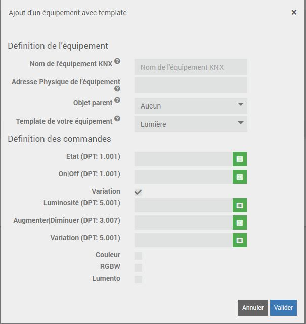
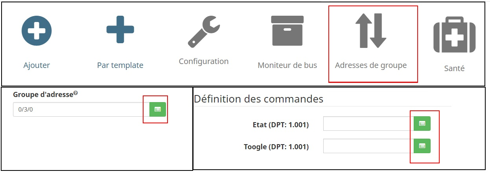
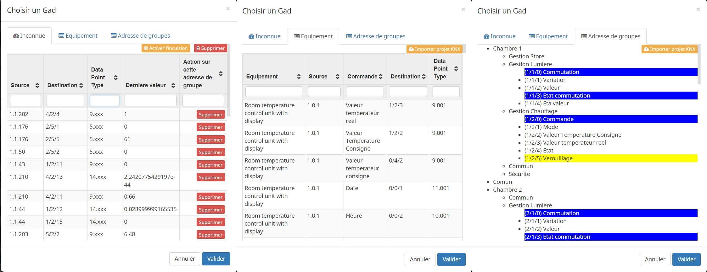

Description 
===========
Ce plugin permet de communiquer entre Jeedom avec votre installation KNX.
Jeedom deviendra donc un equipement de votre installation 
Des fonction d'auto-configuration (auto-include, parser ETS4) ont été implémenté pour permettre une mise en place rapide

Installation et configuration
===========

Configuration du plugin et de ses dépendances
----------------------------------------------

* `Interface de communication` : Choisir l'interface par laquel nous allons nous connecter au bus
  * `KNXd` : Remplacent d'eibd mais pas encore suffisamenent stable 
  * `EIBD` : Recommandé
  * `Manuel` : si EIBD est installer sur une autre machine
  
### Manuel
* `Adresse IP` : Indiquez l'adresse IP de la machine sur lequel tourne EIBD.
* `Port` : Indiquez le port de connexion EIBD (Par défaut 6720)

### KNXD ou EIBD
* `Type de passerelle` : Indiquez le type de passerelle
* `Adresse de la passerelle` : Indiquez l'adresse de la passerelle
* `Adressage des connexions` : Personnalisez l'adresse physique du démon sur votre réseau KNX

### Général
* `Niveau de Gad` : Séléctioner le niveau de gad choisi lors de la programation des equipements

> Pensez à sauvegarder.

Configuration avancée 
---------------------

* `Nom du serveur KNX` : donne un nom au service knxd quand il est utilisé, uniquement pour KNXd

* `Visibilité du serveur KNX` : le serveur knx virtuel répond a un requet permettant de decouvrir les passerelles par un multicat IP dédié au KNX (224.0.23.12).
Cette fonctionnalité est présente dans ETS et liste automatiquement toutes les passerelles sur le réseau locale. En désactivant cette fonctionnalité, le daemon ne répondra plus.

* `Mode Routing` et `Mode Tunnelling` : permet au daemon de devenir un router KNX virtuel.
Le mode Routing permet d’écouter et de réponde au multicat IP dédié au KNX (224.0.23.12)
Le mode Tunnelling permet de se connecter depuis un client IP comme ETS vers le BUS en passant par le deamon. utile si la passerelle IP n’autorise qu’une connexion simultanée et si elle est déjà utilisée par Jeedom.

Installation des dépendances
----------------------------
Pour faciliter la mise en place des dépendances, jeedom vas gérer seul l'installation de la suite logiciele EIBD.

Dans la cadre réservé aux dépendances, vous allez avoir le statut de l'installation.
Nous avons aussi la possibilité de consulter le log d'installation en temps réel
L'installation d'EIBD peux être longue en fonction des performances de la machine qui l'exécute.
Attention, la compilation est gourmande en ressource et peux entrainer des ralentissements dans votre jeedom

Si tous les voyants sont au vert, nous pouvons passer a la suite

Équipement
===========
Dans un premier temps, il faut créer un nouvelle équipement et le nommé.
Comme dans tous les plugins Jeedom vous avez un bouton ajouté un equipement sur la gauche de votre fenetre.

Ce nouvelle équipement a besoin d'être paramétré.

* Nom de l'équipement KNX : Le nom a déjà été paramétrée mais vous avez la possibilité de la changer
* Adresse Physique de l'équipement : cette element n'est pas tres important et peut etre laissé vide
* Objet parent : Ce paramétré permet d'ajouter l'équipement dans un objet Jeedom
* Catégorie : Déclare l'équipement dans une catégorie
* Visible : Permet de rendre l'équipement visible dans le Dashboard
* Activer : Permet d'activer l'équipement
* Délai max entre 2 messages: ce champs permet est utile pour les equipements qui fonctionne sur batterie, il indique a jeedom le delais qu'il doit laissé entre 2 messages avant de vous informé d'un risque de panne.

Commande
===========

Maintenant que votre équipement est crée et configurée, on vas pouvoir y ajouter des commandes.
Pour une bonne integration, il est recommandé d'utilisté les template qui crerra automatiquement toute les commandes necessaire configurer avec le bon Flag

Exemple de configuration

Nommée votre commande de manière a la retrouve facilement dans Jeedom

Configuration KNX
---
Ces champs de configuration sont important pour la communication 
* Data Point Type : ce champs est important et indispensable pour l'encodage et décodage de la valeur.
* Groupe d'addresse : ce champs identifi la commande sur le bus et sur jeedom

Valeur
---
* Retour d'état : Ce paramètre est visible pour une commande de type action, elle permet a jeedom de liée une info a une action
* Valeur : Imposer une valeur a votre commande (lorsque l'on est en type action)
* Inverser : Cette commande permet d'inverser la valeur 

Paramètre
---
* Type : Selectionez le type de commande
* Sous type automatique : Laissez le plugin choisir le sous-type le plus adapté a votre DPT
* Sous Type : Choisissez le sous type le plus adaptée a la valeur transmis ou a transmettre
* Visible : Permet de rendre visible votre commande sur le dashboard
* Historiser : Permet d'enregistrer la valeur

Enfin pensez sauvegarder.

Utilisation des Templates
=========================
Ils existes sur le plugin plusieur templates.
Ceci vous permette de configurer rapidement un equipement.

Creation d'un equipement par template
---

Sur la page principal, un bouton "Ajouter Par template" est présent.
Il vous suffit de selectionné le template et de saisir les gad, ou d'allez chercher les gad importé par ETS ou inconnue.

Creation de commandes par template
---

Selectionner une template et appliquez le.
Le plugin ajoutera et configurera les commandes defini par le template, il vous restera plus qu'a configurer les GAD

Ce mode est pratique si par exemple dans une meme equipement vous voulez ajouter plusieur template

Flag
=====

Flag  Lecture / Read
--------------------

* Actif : Si le participant voit sur le bus un télégramme de type "Lecture / Read" qui correspond à cet objet (= l'objet est lié à l'adresse de groupe de destination du télégramme) alors le participant va répondre en envoyant sur le bus la valeur actuelle de l'objet.
* Inactif : Le participant ne réagira à aucun télégramme de type "Lecture / Read" qui correspond à cet objet.

Pour chaque adresse de groupe, au maximum UN seul objet doit avoir son flag "Lecture/Read" actif, tous les autre objet de cette même adresse de groupe doivent être inactifs, sinon une interrogation de la valeur donnerait plus d'une réponse et on pourrait même obtenir des réponses discordantes.

En général, la valeur stockée ou utilisée par les objets faisant partie d'une même adresse de groupe représente une information correspondant à quelque chose de réel / physique / mesurable dans votre maison.
Pour déterminer lequel de tous les objets faisant partie de la même adresse de groupe doit être celui qui aura son flag "Lecture/Read" actif, il faut vous demander lequel de tous ces objets a le plus de  chance d'être en phase avec la réalité.
Cas simple : 3 boutons poussoirs et un acteur qui allume ou éteint un lampe, la valeur de l'objet de l'acteur a de bien plus grandes chances de réellement représenter l'état (allumé ou éteint) de la lampe, surtout après une panne de courent ou un problème sur le bus ...

Flag  Ecriture / Write
----------------------

* Actif : La valeur de cette commande sera modifiée si un participant envoie sur le bus un télégramme de type "Ecriture/Write" qui
correspond à cet objet (= l'objet est lié à l'adresse de groupe de destination du télégramme).
* Inactif : La valeur de cet objet NE sera PAS modifiée, même si un participant envoie sur le bus un télégramme de type "Ecriture/Writer" qui correspond à cet objet.

Pour une valeur d'adresse de groupe, plusieurs objets peuvent avoir leur flag "Ecriture/Write" actif.
N'importe quel objet dont la valeur doit pouvoir être modifiée par un autre doit avoir sun flag "Ecriture/Write" actif.

Exemples d'objets pour lesquels le flag "Ecriture/Write" est généralement actif :
* En général, tous les commande de type info.

Exemples d'objets pour lesquels le flag "Ecriture/Write" est généralement INACTIF :
* En général, tous les commande de type action.

Flag  Transmission/Transmit
---------------------------

* Actif : Si pour une raison quelconque (sauf la réception d'un télégramme « Ecriture/Write » vers cet objet) la valeur de cette commande venait à être modifiée, le participant va envoyer sur le bus un télégramme de type "Ecriture/Write" contenant la nouvelle valeur, vers la première adresse de groupe liée à cet objet.
* Inactif : Le participant n'envoie aucun télégramme sur le bus quand le retour d'etat est modifiée.

Exemples d'objets pour lesquels le flag "Transmission/Transmit" est généralement actif.
* Si la commande est de type action
* Si le retour d'etat de la commande n'est pas un capteur knx

Exemples d'objets pour lesquels le flag "Transmission/Transmit" est généralement inactif.
* Si le retour d'etat port la meme adresse de groupe.

Flag  Mise-à-jour/Update
------------------------

* Actif : Si un autre participant répond à un télégramme de type "Lecture de la valeur" qui correspond à cet objet (= l'objet est lié à l'adresse de groupe de destination du télégramme) en envoyant une valeur différente de celle actuellement stockée dans l'objet, la valeur de l'objet est remplacée par celle lue sur le bus dans le télégramme de réponse. (= Les télégrammes de réponse de valeur sont interprétés comme instruction d'écriture).
* Inactif : Le participant ne modifie pas la valeur de son objet tant qu'il ne reçoit pas un télégramme "Ecriture/Write".

En théorie, ce flag ne semble pas très utile, mais en pratique, si il est actif il permet de "re-synchroniser" plus rapidement tous les participants d'un bus quand certains ont été redémarrés ou qu'une coupure est survenue sur le bus (arrêt temporaire d'une liaison entre 2 étages ou 2 bâtiments par exemple), dans ce cas, il suffit de lancer un script qui lit touts les groupes et hop tout est resynchronisé.

Exemples d'objets pour lesquels le flag "Mise-à-jour/Update" est généralement actif :
* Si la commande est de type info
* Si le flag "Ecriture/Write" actif.

Exemples d'objets pour lesquels le flag "Mise-à-jour/Update" est généralement inactif :
* Tous les commande qui ont le flag "Lecture/Read" actif.
* Tous les commande qui ont un type action

Flag Initialisation
-------------------

* Actif : Au démarrage du busMonitor, un télégramme de type "Lecture de la valeur" qui correspond à cet objet sera envoyé sur le bus qui mettera a jour Jeedom
* Inactif : Pas de mise a jours.

Exemples d'objets pour lesquels le flag "Initialisation" est généralement actif :
* Si la commande est de type info
* Si le flag "Ecriture/Write" actif.

Exemples d'objets pour lesquels le flag "Read-on-Init" est généralement inactif :
* Tous les commande qui ont le flag "Lecture/Read" actif.
* Tous les commande qui ont un type action

Utilisation du Bus Monitor
==========================

En cliquant sur cette icône ci dessous, vous allez pouvoir visualiser l'activité qui se passe sur votre bus.
Pour le débugage d'une configuration défaillante, il est aussi possible de filtrer les messages enregistrés en mémoire cache.

Avec le bus monitor vous allez pouvoir analyser ce qui se passe sur votre bus et ce que comprend Jeedom au bus.

Le bus monitor affiche l'adresse physique de l’équipement, l'adresse de groupe, la data en hexa et sa conversion

Adresses de groupe
==================

Cette fenetre est disponible a plusieur endroit.

* Sur la page principal
* Sur chaque bouton pour la séléction (Template et commande)

En cliquant sur un des ses bouton vous allez obtenir cette fenetre.

Inconnue
--------

Cette onglet permet de remonter les gad inconnue vue par le bus monitor.
En activant l'inclusion, le bus monitor vas mettre en cache egalement tous les gad qu'il voit et qui sont inconnue a votre installation.
De meme, si vous avez configurer les DPT dans votre projet ETS, et l'adresse physique de votre equipemnt dans votre configuration Jeedom, un filtre sera automatiquement ajouté pour facilité les rechercher

Equipement
----------

Cette onglet permet de lister tous les GAD avec leur equipements.
Pour que remplir ce tableau, il est imperatif d'utiliser le parseur ETS.
Si vous avez ouvert cette fenetre depuis un bouton de selection de GAD, alors vous aurrez la possibilité de selectioner le bon GAD (qui se mettera en gras) et de valider pour retourner a la page de configuration.
De meme, si vous avez configurer les DPT dans votre projet ETS, et l'adresse physique de votre equipemnt dans votre configuration Jeedom, un filtre sera automatiquement ajouté pour facilité les rechercher

Adresse de groupes
------------------

Cette onglet permet de recreer l'arboressance de GAD tel qu'elle est defini dans ETS.
Pour que remplir ce tableau, il est imperatif d'utiliser le parseur ETS.

Si vous avez ouvert cette fenetre depuis un bouton de selection de GAD, alors vous aurrez la possibilité de selectioner le bon GAD (qui se mettera en gras) et de valider pour retourner a la page de configuration.
De meme, si vous avez configurer les DPT dans votre projet ETS, le plugin vous soulignera en bleu lorsque le DPT est identique et en jaune lorsqu'il est compatible

Utilisation du parser ETS
=========================

En téléchargeant votre projet ETS (.knxproj), vous allez permetre a jeedom de charger dans son cache, tout les gad de votre installation.

Avec le parseur vous pouvez luis demander des actions supplémentaire

* Arboressance des groupes : Défini, pour chaque rang de votre arboressance de vos gad, un type d'information. Cette configuration est obligatoire si vous voulez qu'il cree automatiquement vos objets et equipement
* Créer les objets : Le parser cree automatiquement s'il n'existe pas les objets defini dans le rang d'arboressance de vos gad
* Créer les equipements  : Le parser cree automatiquement s'il n'existe pas vos equipement tel que  defini dans le rang d'arboressance de vos gad. Il sera toutefois imperatif de remprendre la configuration de chaqu'un car le fichier ETS ne defini pas tout.
* Uniquement correspondant a un Template : Cette option permet de cree un equipement qui corresponde a un Template. Pour que le plugin puisse identifier le template et ses commandes, l'architecture de gad de votre projet doit corresponde exactement au projet ETS.[Voici un exemple]: https://github.com/mika-nt28/Jeedom-Eibd/raw/master/docs/images/Jeedom_Template.knxproj
* Importer votre projet : Champs d'import de votre projet ETS (.knxproj)

Utilisation de la passerelle Jeedom/KNX
=======================================
Pour être au plus proche du KNX, le plugin peut se comporter comme un participant.
On peut donc configurer le plugin pour qu'il réalise des actions automatiquement.

Envoyer une valeur sur le bus. 
-----------------------------

Vous avez sur jeedom un capteur qui n'est pas KNX, mais vous souhaiteriez le lier directement à votre réseau ?
Pour cela il suffit de configurer votre commande ainsi:

* Créer une commande de type "action"
* Saisir le GAD qui correspond à l'objet KNX que vous souhaitez mettre à jour
* Activer le Flag "Transmettre"
* En retour d'état allez chercher la commande de votre capteur.

Répondre à une commande "Read" en provenance du bus
----------------------------------------------------

Le plugin est capable de répondre à un interrogation du bus.
Pour cela il suffit de configurer votre commande ainsi:

* Créer une commande de type "info"
* Saisir le GAD qui correspond à l'objet KNX que vous souhaitez surveiller
* Activer le flag "Lecture"

Mode cyclique
-------------

Vous avez besoin de lire un etat ou d'envoyer une valeur sur le bus de maniere cyclique (comme une horloge ou un etat a la vanne thermostatique)
Rien de plus simple, il suffit de choisir sur votre commande de type action une base de temps, le plugin fait le reste.

FAQ
===

Comment créer une commande pour allumer la lumière alors que physiquement, je n'ai pas d’interrupteur ?  
-------------------------------------------------------------------------------------------------------
Sous jeedom, nous pouvons créer des interrupteurs virtuels en configurant une commande de type action.
Les éléments importants pour envoyer des informations sur le bus avec jeedom sont :

* Adresse de groupe
* Le DPT pour son encodage
On verra apparaitre sur le bus monitor la commande envoyée avec l'adresse physique d'eibd

Je n'arrive pas a émetre une information avec ma passerelle Hager th102 ?
---------------------------------------------------------------------------
Le script de démarage fonctionne mal avec cette passerelle.
Il faut utiliser cette ligne pour lancer eibd

> eibd -D -S -T -t1023 -i usb:1:6:1:0:0 -e 1.1.128 -R -u
